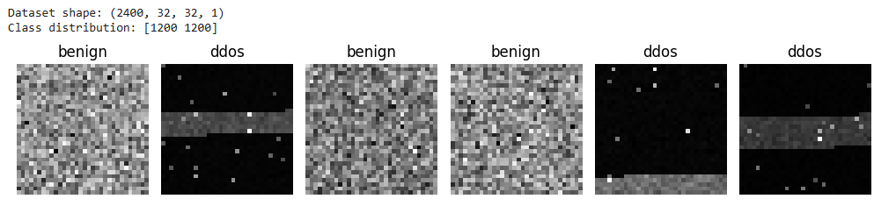
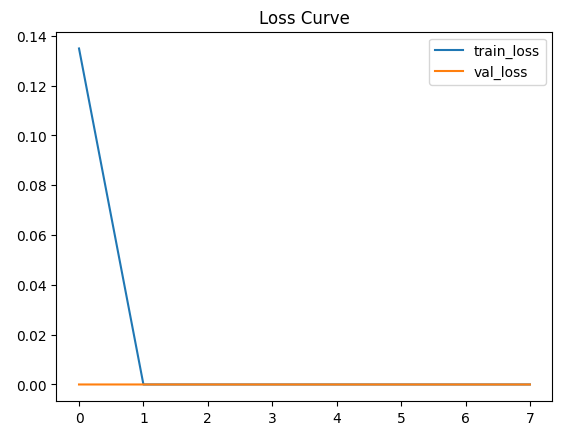

# Convolutional Neural Networks (CNN)

## Theory and Cybersecurity Application Example

---

## 1. Introduction

A **Convolutional Neural Network (CNN)** is a specialized type of artificial neural network designed to process structured grid-like data, most commonly images. Unlike fully connected neural networks, CNNs use **convolutional layers** that apply learnable filters (kernels) across local regions of the input. This architecture enables efficient feature extraction while reducing the number of parameters.

The core components of CNNs include:

- **Convolution Layer (Conv2D)** – extracts spatial features.
- **Activation Function (ReLU)** – introduces non-linearity:

  \[
  ReLU(x) = \max(0, x)
  \]

- **Pooling Layer (MaxPooling)** – reduces spatial resolution and improves robustness.
- **Flatten Layer** – converts feature maps into a vector.
- **Dense (Fully Connected) Layer** – performs classification.
- **Output Layer (Sigmoid)** – produces probability for binary classification:

  \[
  \sigma(z) = \frac{1}{1 + e^{-z}}
  \]

CNNs are trained using **binary cross-entropy loss**:

\[
L = -\frac{1}{N}\sum\_{i=1}^{N} \left[y_i \log(\hat{y}_i) + (1-y_i)\log(1-\hat{y}_i)\right]
\]

In cybersecurity, CNNs are applied to malware image detection, packet-flow heatmaps, anomaly detection, and DDoS pattern recognition. Their ability to detect spatial patterns makes them particularly effective when traffic behavior is converted into image representations.

---

## 2. CNN Architecture Used in This Work

The implemented architecture consists of:

- 3 Convolution layers (16, 32, 64 filters)
- 3 MaxPooling layers
- Flatten layer
- Dense layer (64 neurons)
- Dropout (0.3)
- Output layer (Sigmoid activation)

Total parameters: **88,961 trainable parameters**

This structure progressively extracts low-level to high-level traffic patterns from the generated grayscale images.

---

## 3. Cybersecurity Example: DDoS-like Traffic Classification

### 3.1 Methodology

Synthetic web traffic windows were generated and classified into:

- **Benign traffic**
- **DDoS-like burst traffic**

Each traffic window contains 1024 traffic intensity values and is reshaped into a **32×32 grayscale image**, where pixel intensity corresponds to request magnitude.

This transformation allows CNN to learn spatial burst patterns rather than simple numeric thresholds.

### 3.2 Source Code

```python
# ================================
# CNN for DDoS-like Traffic Detection
# Single Executable Script (Google Colab Ready)
# ================================

import numpy as np
import matplotlib.pyplot as plt
from sklearn.model_selection import train_test_split
from sklearn.metrics import confusion_matrix, classification_report
import tensorflow as tf
from tensorflow.keras import layers, models

np.random.seed(42)
tf.random.set_seed(42)
rng = np.random.default_rng(42)

IMG_H, IMG_W = 32, 32
WINDOW_LEN = IMG_H * IMG_W
N_BENIGN = 1200
N_DDOS = 1200

def make_benign_window():
    base = rng.normal(15, 3, WINDOW_LEN)
    return np.clip(base, 0, None)

def make_ddos_window():
    x = rng.normal(20, 5, WINDOW_LEN)
    x = np.clip(x, 0, None)

    # sustained burst (safe slicing)
    start = rng.integers(100, 900)
    length = rng.integers(120, 260)
    end = min(start + length, WINDOW_LEN)

    burst_len = end - start
    burst = rng.normal(220, 30, burst_len)
    x[start:end] += np.clip(burst, 150, 400)

    # random spikes
    for _ in range(rng.integers(8, 20)):
        idx = rng.integers(0, WINDOW_LEN)
        x[idx] += rng.integers(200, 500)

    return x

def window_to_image(window):
    w = (window - window.min()) / (window.max() - window.min() + 1e-9)
    return (w.reshape(IMG_H, IMG_W) * 255.0).astype(np.uint8)

benign_imgs = np.array([window_to_image(make_benign_window()) for _ in range(N_BENIGN)])
ddos_imgs   = np.array([window_to_image(make_ddos_window()) for _ in range(N_DDOS)])

X = np.concatenate([benign_imgs, ddos_imgs], axis=0)
y = np.concatenate([np.zeros(N_BENIGN), np.ones(N_DDOS)], axis=0)

X = X[..., np.newaxis].astype(np.float32) / 255.0

print("Dataset shape:", X.shape)
print("Class distribution:", np.bincount(y.astype(int)))

plt.figure(figsize=(10,3))
for i in range(6):
    plt.subplot(1,6,i+1)
    idx = np.random.randint(0, len(X))
    plt.imshow(X[idx].squeeze(), cmap='gray')
    plt.title("ddos" if y[idx] == 1 else "benign")
    plt.axis("off")
plt.tight_layout()
plt.show()

X_train, X_test, y_train, y_test = train_test_split(
    X, y, test_size=0.25, random_state=42, stratify=y
)

model = models.Sequential([
    layers.Input(shape=(IMG_H, IMG_W, 1)),
    layers.Conv2D(16, (3,3), activation='relu', padding='same'),
    layers.MaxPooling2D((2,2)),
    layers.Conv2D(32, (3,3), activation='relu', padding='same'),
    layers.MaxPooling2D((2,2)),
    layers.Conv2D(64, (3,3), activation='relu', padding='same'),
    layers.MaxPooling2D((2,2)),
    layers.Flatten(),
    layers.Dense(64, activation='relu'),
    layers.Dropout(0.3),
    layers.Dense(1, activation='sigmoid')
])

model.compile(
    optimizer=tf.keras.optimizers.Adam(learning_rate=0.001),
    loss='binary_crossentropy',
    metrics=['accuracy']
)

model.summary()

history = model.fit(
    X_train, y_train,
    validation_split=0.2,
    epochs=8,
    batch_size=32,
    verbose=1
)

plt.figure()
plt.plot(history.history['loss'], label='train_loss')
plt.plot(history.history['val_loss'], label='val_loss')
plt.legend()
plt.title("Loss Curve")
plt.show()

plt.figure()
plt.plot(history.history['accuracy'], label='train_acc')
plt.plot(history.history['val_accuracy'], label='val_acc')
plt.legend()
plt.title("Accuracy Curve")
plt.show()

proba = model.predict(X_test).ravel()
y_pred = (proba >= 0.5).astype(int)

print("\nClassification Report:\n")
print(classification_report(y_test, y_pred, target_names=["benign","ddos"]))

cm = confusion_matrix(y_test, y_pred)

plt.figure()
plt.imshow(cm, cmap='Blues')
plt.title("Confusion Matrix")
plt.xticks([0,1], ["benign","ddos"])
plt.yticks([0,1], ["benign","ddos"])
for (i,j), val in np.ndenumerate(cm):
    plt.text(j, i, str(val), ha='center', va='center')
plt.xlabel("Predicted")
plt.ylabel("Actual")
plt.show()

```

---

## 4. Visualizations

### Figure 1 – Sample Generated Traffic Images



**Figure 1** shows grayscale representations of benign and DDoS traffic windows.  
DDoS samples exhibit high-intensity clustered regions compared to benign samples.

---

### Figure 2 – Training and Validation Loss Curve



**Figure 2** demonstrates rapid convergence of the CNN model.  
The validation loss decreases significantly, indicating effective pattern learning.

---

### Figure 3 – Training and Validation Accuracy Curve


**Figure 3** shows that the model achieves high classification accuracy early during training.

---

### Figure 4 – Confusion Matrix


**Figure 4** presents the confusion matrix.  
Both classes (benign and ddos) are correctly classified with no misclassifications on the synthetic dataset.

---

## 5. Results Interpretation

The classification report indicates:

- Precision = 1.00
- Recall = 1.00
- F1-score = 1.00
- Accuracy = 1.00

This perfect performance is expected due to clear separability in the synthetic dataset. In real-world scenarios, traffic patterns would exhibit greater overlap and noise, leading to slightly lower but more realistic performance metrics.

The **F1-score** is particularly important in cybersecurity, as it balances false positives and false negatives. Missing a DDoS attack (false negative) can have severe operational consequences.

---

## 6. Reproducibility

To reproduce results:

1. Open Google Colab.
2. Copy the Python script provided in this repository.
3. Run all cells.
4. The script will generate:
   - Sample traffic images
   - Loss curve
   - Accuracy curve
   - Confusion matrix

All visualizations shown above are generated automatically by the script.

---

## 7. Conclusion

This work demonstrates how Convolutional Neural Networks can be applied in cybersecurity by transforming traffic statistics into image representations. CNNs effectively learn burst and spike patterns typical for DDoS attacks without relying on fixed thresholds. The model architecture is efficient and achieves strong classification performance on the generated dataset.

This approach illustrates how deep learning techniques can enhance anomaly detection systems beyond traditional rule-based mechanisms.

