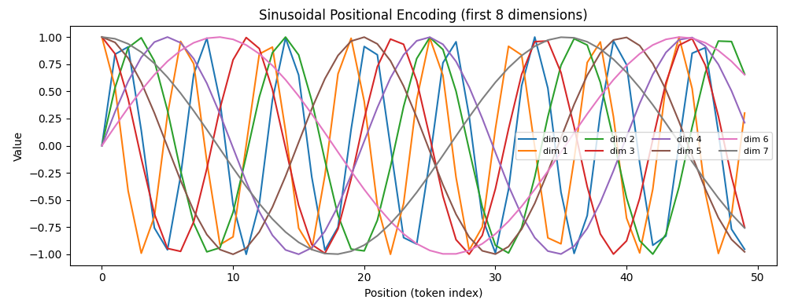
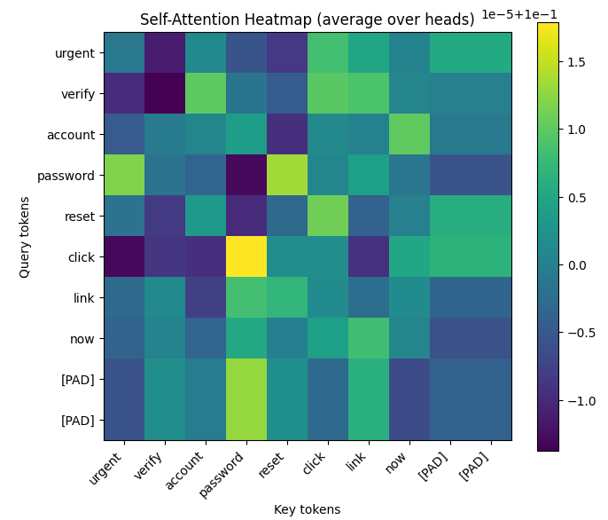

# Transformer Networks — Theory and Cybersecurity Applications

---

## 1. What is a Transformer?

A **Transformer** is a neural network architecture designed for modeling **sequential data** (text, logs, events, packets, API calls) using an **attention mechanism** instead of recurrent connections. Unlike RNNs/LSTMs that process tokens step-by-step, Transformers can process all tokens in parallel, which improves training efficiency and helps learn long-range dependencies.

The core building blocks are:

- **Token Embedding**: maps discrete tokens to vectors.
- **Positional Encoding**: injects token order information (because attention alone is permutation-invariant).
- **Multi-Head Self-Attention**: each token can “attend” to other tokens and weigh their importance.
- **Feed-Forward Network (FFN)**: non-linear transformation applied to each position.
- **Residual connections + Layer Normalization**: improve stability and gradient flow.

### Self-Attention (intuition + formula)

Self-attention computes how much each token should focus on other tokens. It creates **Query (Q)**, **Key (K)**, and **Value (V)** vectors, and computes attention weights:

\[
Attention(Q,K,V) = softmax\left(\frac{QK^T}{\sqrt{d_k}}\right)V
\]

This allows a token (e.g., the word “reset”) to strongly attend to related tokens (e.g., “password”, “link”, “urgent”), which is useful in cybersecurity tasks like phishing detection and log anomaly detection.

---

## 2. Positional Encoding

Because Transformers do not have recurrence, they require **positional information**. A common approach is **sinusoidal positional encoding**:

\[
PE(pos,2i)=\sin\left(\frac{pos}{10000^{2i/d}}\right), \quad
PE(pos,2i+1)=\cos\left(\frac{pos}{10000^{2i/d}}\right)
\]

This gives each position a unique “signature” across embedding dimensions.

### Figure 1 — Positional Encoding Visualization



---

## 3. Attention Visualization (Required)

Attention can be visualized as a matrix where rows are “query tokens” and columns are “key tokens”. Darker/higher values indicate stronger focus.

### Figure 2 — Attention Heatmap (example)



---

## 4. Transformer Applications in Cybersecurity

Transformers are strong candidates for cybersecurity because many security signals are **sequences**:

- **Phishing detection**: classify email text using contextual understanding (urgency, credential requests, suspicious links).
- **Web/server log anomaly detection**: model sequences of status codes, URL patterns, user agents, and detect abnormal behavior.
- **Malware behavior modeling**: analyze sequences of API calls or system events.
- **SOC alert enrichment**: summarize incident narratives, correlate events, and extract entities.

Compared to rule-based systems, Transformers can learn subtle context (e.g., benign “password reset” vs. manipulative phishing language) and adapt to changing attacker strategies.

---

## 5. Reproducibility (Google Colab)

1. Open Google Colab
2. Run the single Python block below
3. It will generate and save:
   - `positional_encoding.png` (Figure 1)
   - `attention_heatmap.png` (Figure 2)

Upload those images into the same GitHub folder as this `transformer.md`.

---

## 6. Single Executable Code Block (Colab-ready)

```python
# ==========================================
# Transformer Visualizations + Mini Cyber Demo (Colab Ready)
# Generates:
#  - positional_encoding.png
#  - attention_heatmap.png
# ==========================================

import numpy as np
import matplotlib.pyplot as plt
import tensorflow as tf
from tensorflow.keras import layers

np.random.seed(42)
tf.random.set_seed(42)

# ----------------------------
# Part A: Positional Encoding
# ----------------------------
def sinusoidal_positional_encoding(max_len: int, d_model: int) -> np.ndarray:
    pos = np.arange(max_len)[:, np.newaxis]                 # (max_len, 1)
    i = np.arange(d_model)[np.newaxis, :]                   # (1, d_model)
    angle_rates = 1 / np.power(10000, (2 * (i // 2)) / np.float32(d_model))
    angles = pos * angle_rates
    pe = np.zeros((max_len, d_model), dtype=np.float32)
    pe[:, 0::2] = np.sin(angles[:, 0::2])
    pe[:, 1::2] = np.cos(angles[:, 1::2])
    return pe

max_len = 50
d_model = 32
pe = sinusoidal_positional_encoding(max_len, d_model)

# Plot a subset of dimensions for readability
plt.figure(figsize=(10,4))
for dim in range(0, 8):
    plt.plot(pe[:, dim], label=f"dim {dim}")
plt.title("Sinusoidal Positional Encoding (first 8 dimensions)")
plt.xlabel("Position (token index)")
plt.ylabel("Value")
plt.legend(ncol=4, fontsize=8)
plt.tight_layout()
plt.savefig("positional_encoding.png", dpi=200)
plt.show()

# ----------------------------
# Part B: Attention Heatmap
# ----------------------------
# We'll create a tiny Transformer-like attention example using MultiHeadAttention
# and visualize attention scores for one synthetic "phishing-like" sentence.

# Simple toy vocabulary + tokenization (self-contained)
vocab = {
    "[PAD]": 0, "urgent": 1, "verify": 2, "account": 3, "password": 4, "reset": 5,
    "click": 6, "link": 7, "now": 8, "hello": 9, "meeting": 10, "schedule": 11
}
inv_vocab = {v:k for k,v in vocab.items()}

def encode(tokens, max_len=10):
    ids = [vocab.get(t, 0) for t in tokens][:max_len]
    ids += [0] * (max_len - len(ids))
    return np.array(ids, dtype=np.int32)

tokens = ["urgent", "verify", "account", "password", "reset", "click", "link", "now"]
x_ids = encode(tokens, max_len=10)[np.newaxis, :]  # (1, 10)

# Embedding + Multi-Head Attention
embed_dim = 32
num_heads = 4

embedding = layers.Embedding(input_dim=len(vocab), output_dim=embed_dim)
mha = layers.MultiHeadAttention(num_heads=num_heads, key_dim=embed_dim // num_heads)

x_emb = embedding(x_ids)  # (1, 10, 32)

# Get attention scores (shape: (batch, heads, query_len, key_len))
attn_out, attn_scores = mha(
    query=x_emb, value=x_emb, key=x_emb,
    return_attention_scores=True
)

# Average over heads for a single heatmap
attn = attn_scores.numpy()[0].mean(axis=0)  # (10, 10)

# Labels for plot (token strings including PAD)
labels = [inv_vocab.get(int(t), "[UNK]") for t in x_ids[0]]

plt.figure(figsize=(7,6))
plt.imshow(attn, interpolation="nearest")
plt.title("Self-Attention Heatmap (average over heads)")
plt.xticks(range(len(labels)), labels, rotation=45, ha="right")
plt.yticks(range(len(labels)), labels)
plt.xlabel("Key tokens")
plt.ylabel("Query tokens")
plt.colorbar()
plt.tight_layout()
plt.savefig("attention_heatmap.png", dpi=200)
plt.show()

print("Saved images: positional_encoding.png, attention_heatmap.png")
```

--

## 7. Conclusion

Transformers use self-attention to model relationships between tokens across a sequence and rely on positional encoding to represent token order. These properties make Transformer networks highly effective for cybersecurity tasks involving text and event sequences, such as phishing detection and log anomaly detection. The attention and positional encoding visualizations above illustrate the core mechanisms that enable Transformers to capture contextual patterns beyond simple rule-based approaches.
