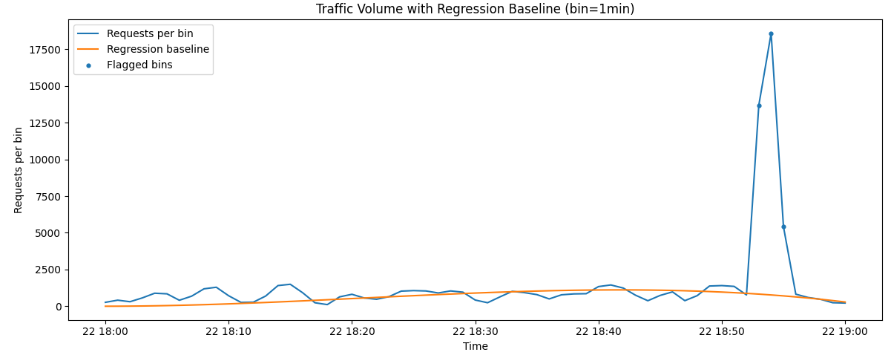
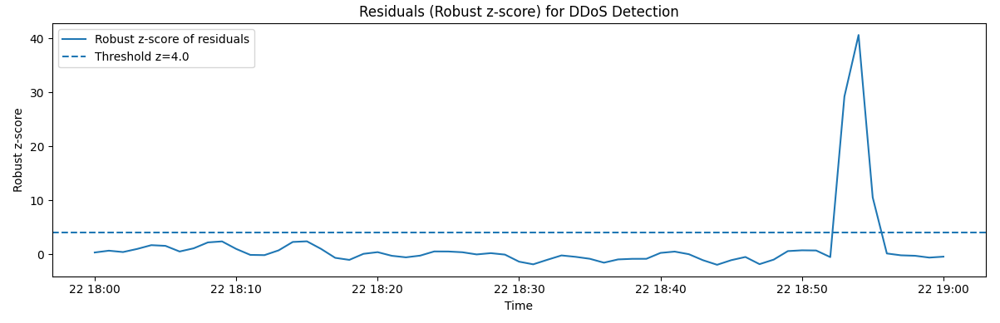

# Web Server Log Analysis --- DDoS Detection Using Regression

---

## 1. Introduction

The goal of this task is to detect time interval(s) of a Distributed
Denial-of-Service (DDoS) attack using regression-based anomaly detection
applied to web server log data.

Instead of using simple traffic thresholds, a regression model is fitted
to normal traffic behavior. Significant positive deviations from this
baseline are treated as potential attack intervals.

---

## 2. Dataset

The analyzed log file is available here:

🔗 **[Server Log File](n_bukuri25_73625_server.log)**

The file contains web server request logs including:

- Client IP
- Timestamp
- HTTP method
- URL
- Status code
- Response size
- User agent

From the file:

- Total parsed timestamps: _(insert your value from output)_
- Time range: _(insert start time → end time from output)_

Timestamps were extracted and aggregated into fixed time bins (1-minute
resolution) to compute the number of requests per interval.

---

## 3. Methodology

### 3.1 Time-Series Construction

1.  Extract timestamps from log entries.
2.  Convert to datetime format.
3.  Aggregate request counts per time bin:

Requests(t) = Number of log entries in bin t

---

### 3.2 Regression Baseline Modeling

To model expected traffic behavior, a robust regression model (Huber
Regressor) with polynomial features was applied:

```python
model = Pipeline([
    ("poly", PolynomialFeatures(degree=3, include_bias=False)),
    ("huber", HuberRegressor(epsilon=1.35))
])
```

The regression estimates the smooth baseline traffic trend.

---

### 3.3 Residual Analysis

Residuals are computed as:

r(t) = y(t) - ŷ(t)

To detect extreme deviations, a robust z-score based on Median Absolute
Deviation (MAD) was calculated:

rz = (r(t) - median(r)) / (1.4826 \* MAD)

Bins with rz ≥ 4 were flagged as anomalous.

To avoid noise, at least 3 consecutive anomalous bins were required to
define an attack interval.

---

## 4. Detected DDoS Interval(s)

### 🚨 Detected DDoS Interval(s)

- 2024-03-22 18:53:00 -> 2024-03-22 18:56:00 (bin=1min, z>=4.0, min_bins=3)

---

## 5. Visualizations

### Figure 1 --- Traffic Volume with Regression Baseline



Figure 1 shows the observed request counts along with the regression
baseline. Highlighted points indicate bins flagged as anomalous.

---

### Figure 2 --- Residual Robust Z-Score



Figure 2 illustrates the robust z-score of residuals. The dashed
horizontal line indicates the anomaly threshold (z ≥ 4). Sustained
exceedances correspond to DDoS intervals.

---

## 6. Key Code Fragments

### Timestamp Parsing

```python
BRACKET_ISO_RE = re.compile(
    r"\[(\d{4}-\d{2}-\d{2}[ T]\d{2}:\d{2}:\d{2}(?:[+\-]\d{2}:\d{2})?)\]"
)
```

---

### Residual & Robust Z-Score Calculation

```python
series["residual"] = series["req_count"] - series["baseline"]

med = np.median(series["residual"])
mad = np.median(np.abs(series["residual"] - med)) + 1e-9

series["rz"] = (series["residual"] - med) / (1.4826 * mad)
```

---

### Consecutive Interval Detection Logic

```python
if run_len >= MIN_CONSECUTIVE_BINS:
    ddos_intervals.append((run_start, run_end))
```

---

## 7. Reproducibility

To reproduce the results:

1.  Place `n_bukuri25_73625_server.log` in the same directory.
2.  Run `ddos_detection.py`.
3.  The script will:
    - Parse timestamps
    - Aggregate traffic
    - Perform regression analysis
    - Print detected DDoS interval(s)
    - Generate visualization files

---

## 8. Conclusion

This work demonstrates how regression-based anomaly detection can
identify DDoS attack intervals in web server logs. By modeling normal
traffic behavior and detecting sustained deviations using robust
statistical thresholds, attack periods can be identified more reliably
than simple fixed thresholds.

The use of robust regression and MAD-based z-score improves resistance
to outliers and provides a statistically grounded method for anomaly
detection in cybersecurity monitoring systems.
